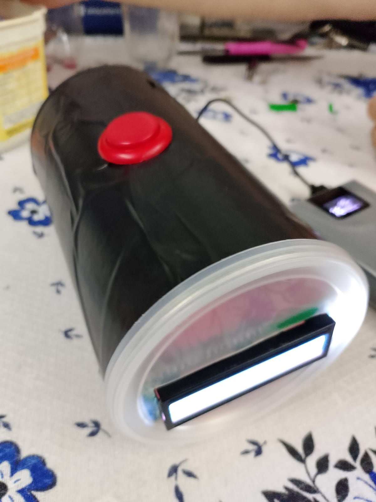

# 🚀 Elevador Inteligente Acessível (EIA)

🇧🇷 Português | 🇺🇸 [English Version](README_EN.md)

## 📌 Descrição

O projeto **Elevador Inteligente Acessível (EIA)** foi desenvolvido com o objetivo de promover maior acessibilidade e autonomia para pessoas com mobilidade reduzida por meio da aplicação de tecnologias de **Internet das Coisas (IoT)**.

A solução consiste em um dispositivo embarcado baseado em **ESP32**, responsável por registrar solicitações de acessibilidade através de um botão físico, processar informações localmente e enviar eventos para uma **API REST**, que realiza a validação do dispositivo e o armazenamento das informações em banco de dados **MySQL**.

Além do registro dos eventos, o sistema disponibiliza um **dashboard web** para monitoramento e consulta dos dados coletados.

---

## 🎯 Problema

Elevadores convencionais normalmente não possuem mecanismos inteligentes voltados à acessibilidade, o que pode dificultar sua utilização por pessoas com deficiência ou mobilidade reduzida.

Os principais problemas identificados foram:

- Dependência de terceiros para utilização do elevador;
- Tempo insuficiente para entrada e saída;
- Ausência de monitoramento dos eventos de acessibilidade;
- Falta de indicadores para análise do uso do sistema;
- Baixa autonomia dos usuários;
- Ausência de integração entre dispositivos físicos e sistemas de gestão.

---

## 💡 Solução

O projeto implementa uma solução baseada em IoT capaz de registrar solicitações de acessibilidade e disponibilizar essas informações para monitoramento em tempo real.

### Funcionalidades Implementadas

- Acionamento através de botão físico;
- Registro de eventos de acessibilidade;
- Sincronização automática de data e hora via NTP;
- Comunicação HTTP com API REST;
- Identificação do dispositivo através do MAC Address;
- Persistência dos dados em banco MySQL;
- Feedback visual utilizando LED;
- Exibição de mensagens operacionais em display LCD I2C;
- Reconexão automática da rede Wi-Fi;
- Disponibilização dos registros em dashboard web.

---

## 📌 Diagrama de Caso de Uso


---

## 🏗️ Arquitetura do Sistema

A solução utiliza uma arquitetura distribuída baseada em Internet das Coisas.

```text
Usuário
   ↓
Botão de Acessibilidade
   ↓
ESP32
   ↓
Wi-Fi
   ↓
API REST (Spring Boot)
   ↓
Validação por MAC Address
   ↓
Banco MySQL
   ↓
Dashboard Web
```

### 📷 Diagrama de Arquitetura


---

## 🎓 Integração das Unidades Curriculares

O projeto integra conhecimentos desenvolvidos ao longo do curso e demonstra a aplicação prática dos conteúdos estudados.

### 🌐 Internet das Coisas (IoT)

- Programação do ESP32;
- Integração entre hardware e software;
- Comunicação em rede;
- Desenvolvimento do firmware embarcado;
- Tratamento de eventos físicos.

### ☁️ Cloud Computing

- Integração entre dispositivos e serviços;
- Comunicação entre sistemas distribuídos;
- Disponibilização dos dados para monitoramento;
- Consumo de APIs.

### 🔐 Segurança de Sistemas

- Identificação única por MAC Address;
- Controle de dispositivos autorizados;
- Rastreabilidade dos eventos;
- Aplicação dos conceitos de Security by Design;
- Conformidade com princípios da LGPD.

### 📊 Análise e Projeto de Sistemas

- Levantamento de requisitos;
- Modelagem UML;
- Diagramas do sistema;
- Arquitetura da solução;
- Documentação técnica.

### ✅ Qualidade de Software

- Tratamento de falhas;
- Validação de respostas HTTP;
- Testes funcionais;
- Confiabilidade da solução;
- Estratégias de mitigação de riscos.

### 👥 Comportamento do Consumidor

- Identificação da necessidade de acessibilidade;
- Levantamento do problema;
- Definição do público-alvo;
- Justificativa da solução proposta.

### 📱 Unidade de Extensão Mobile

- Desenvolvimento do dashboard web;
- Interface para visualização dos eventos;
- Consulta de registros;
- Monitoramento operacional.

---

## ⚙️ Tecnologias Utilizadas

### Hardware

- ESP32
- Botão físico
- LED indicador
- Display LCD I2C 16x2

### Firmware

- C++
- Arduino IDE
- ArduinoJson
- WiFi Library
- HTTPClient
- NTP (Network Time Protocol)

### Backend

- Java 21
- Spring Boot
- Spring Data JPA
- Spring Validation
- API REST

### Banco de Dados

- MySQL

### Front-End

- V0
- Vercel
- Dashboard Web

### Ferramentas

- Git
- GitHub
- Figma
- Draw.io

---

## 🔄 Funcionamento

1. O usuário pressiona o botão de acessibilidade;
2. O ESP32 detecta o acionamento;
3. O dispositivo verifica a conectividade da rede Wi-Fi;
4. O horário é sincronizado através do protocolo NTP;
5. Um payload JSON é criado contendo data, hora e tipo do evento;
6. O evento é enviado para a API REST através de uma requisição HTTP POST;
7. A API valida a identificação do dispositivo através do MAC Address;
8. Os dados são persistidos em banco MySQL;
9. O LCD exibe o resultado da operação;
10. O LED confirma visualmente o processamento do evento;
11. O dashboard disponibiliza as informações registradas para consulta.

---

## 🔁 Fluxograma do Sistema


---

## 🛡️ Arquitetura Resiliente / Edge Computing

O sistema aplica conceitos de Edge Computing ao realizar parte do processamento diretamente no ESP32.

Características implementadas:

- Processamento local dos eventos;
- Feedback imediato ao usuário;
- Operação independente do dashboard;
- Reconexão automática da rede;
- Tratamento de falhas de comunicação;
- Continuidade operacional;
- Redução da dependência da camada de visualização.


---

## 🔄 Diagrama de Sequência


---

## 📋 Requisitos

### ✔️ Requisitos Funcionais

- RF01 – Detectar o acionamento do botão físico;
- RF02 – Registrar eventos de acessibilidade;
- RF03 – Sincronizar data e hora via NTP;
- RF04 – Gerar payload JSON contendo informações do evento;
- RF05 – Enviar eventos para API REST;
- RF06 – Validar dispositivos autorizados;
- RF07 – Armazenar dados em banco MySQL;
- RF08 – Exibir mensagens operacionais no display LCD;
- RF09 – Acionar LED indicador após confirmação da operação;
- RF10 – Disponibilizar histórico de eventos;
- RF11 – Permitir monitoramento através do dashboard web.

### ✔️ Requisitos Não Funcionais

- RNF01 – Operar utilizando rede Wi-Fi;
- RNF02 – Utilizar protocolo HTTP;
- RNF03 – Utilizar formato JSON para troca de dados;
- RNF04 – Possuir identificação única do dispositivo;
- RNF05 – Possuir tratamento de falhas de rede;
- RNF06 – Possuir tratamento de erros HTTP;
- RNF07 – Garantir persistência dos dados;
- RNF08 – Possuir arquitetura escalável;
- RNF09 – Possuir baixo consumo de recursos;
- RNF10 – Permitir monitoramento remoto;
- RNF11 – Atender aos princípios da LGPD.

---

## 🔐 Segurança e LGPD

O projeto foi desenvolvido seguindo os princípios de **Security by Design**, incorporando mecanismos de segurança desde sua concepção.

### Medidas Implementadas

- Identificação do dispositivo por MAC Address;
- Validação de dispositivos autorizados;
- Registro de eventos para rastreabilidade;
- Armazenamento apenas de dados operacionais;
- Ausência de coleta de dados pessoais identificáveis;
- Estrutura preparada para autenticação futura;
- Conformidade com os princípios da LGPD.

---

## 🧪 MVP Desenvolvido

### 📡 Camada IoT

- ESP32 conectado à rede Wi-Fi;
- Botão físico de acionamento;
- Display LCD I2C;
- LED indicador;
- Comunicação HTTP com API REST;
- Sincronização de horário via NTP.

### 🗄️ Backend

- API REST desenvolvida em Spring Boot;
- Persistência em banco MySQL;
- Validação de dispositivos;
- Registro de data, hora e identificação do dispositivo.

### 📱 Dashboard Web

- Monitoramento dos eventos;
- Consulta ao histórico;
- Visualização dos registros;
- Interface desenvolvida com V0 e hospedada na Vercel.

---

## 📸 Evidências do Projeto

### 📷 Protótipo Físico

> Inserir foto do ESP32 montado com botão, LED e display LCD.




### 💻 Serial Monitor

> Inserir captura de tela da execução do firmware.


### 📱 Dashboard Web

> Inserir captura de tela do dashboard desenvolvido.


### 🗄️ Banco de Dados

> Inserir captura de tela dos registros armazenados no MySQL.


---

## 📈 Resultados Obtidos

Durante os testes realizados foi possível validar:

- Conexão Wi-Fi do ESP32;
- Sincronização de horário via NTP;
- Comunicação HTTP com a API REST;
- Validação de dispositivos autorizados;
- Persistência dos dados em MySQL;
- Funcionamento do display LCD;
- Funcionamento do LED indicador;
- Atualização do dashboard;
- Integração entre todas as camadas do sistema.

Os resultados demonstraram a viabilidade técnica da solução e a integração bem-sucedida entre hardware, software, banco de dados e interface de monitoramento.

---

## 📊 Backlog

O projeto é organizado utilizando GitHub Projects no modelo Kanban.

### Itens do MVP

- Registro de eventos;
- Comunicação com API;
- Persistência dos dados;
- Dashboard de monitoramento.

### Evoluções Futuras

- Sensores de presença;
- Aplicativo mobile nativo;
- Dashboard analítico avançado;
- Notificações em tempo real;
- Monitoramento de múltiplos elevadores;
- Indicadores avançados de acessibilidade.

---

## 🚀 Como Executar

### ESP32

1. Conectar o ESP32 ao computador;
2. Abrir o projeto na Arduino IDE;
3. Instalar as bibliotecas necessárias;
4. Configurar SSID e senha da rede Wi-Fi;
5. Configurar a URL da API;
6. Realizar upload do firmware;
7. Monitorar a execução através do Serial Monitor.

### Backend

1. Configurar banco de dados MySQL;
2. Ajustar credenciais da aplicação;
3. Executar a API Spring Boot;
4. Validar o endpoint de recebimento dos eventos.

### Dashboard

1. Executar o projeto frontend;
2. Configurar integração com a API;
3. Publicar na Vercel.

---

## 📁 Estrutura do Projeto

```text
/iot
 └── Firmware ESP32

/api
 └── API REST Spring Boot

/database
 └── Scripts MySQL

/mobile
 └── Dashboard Web

/docs
 └── Relatórios e documentação

/assets
 └── Diagramas e imagens
```

---

## 🔮 Melhorias Futuras

- Integração com sensores de presença;
- Aplicativo mobile completo;
- Dashboard analítico avançado;
- Notificações em tempo real;
- Monitoramento de múltiplos elevadores;
- Indicadores de acessibilidade e utilização;
- Integração com sistemas institucionais;
- Relatórios automáticos de utilização.

---

## 📌 Conclusão

O projeto **Elevador Inteligente Acessível (EIA)** demonstra a aplicação prática dos conceitos de Internet das Coisas, Cloud Computing, Segurança de Sistemas, Qualidade de Software, Desenvolvimento Mobile e Análise de Sistemas.

A solução integra hardware, software, banco de dados e interface web para criar uma plataforma capaz de registrar eventos de acessibilidade, armazenar informações de forma estruturada e disponibilizar monitoramento em tempo real.

Os resultados obtidos comprovam a viabilidade da proposta e evidenciam o potencial da tecnologia para contribuir com iniciativas voltadas à inclusão, acessibilidade e transformação digital em ambientes institucionais.
