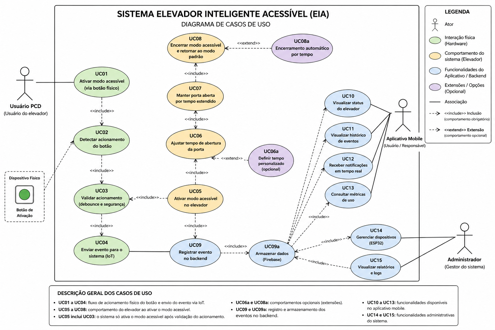
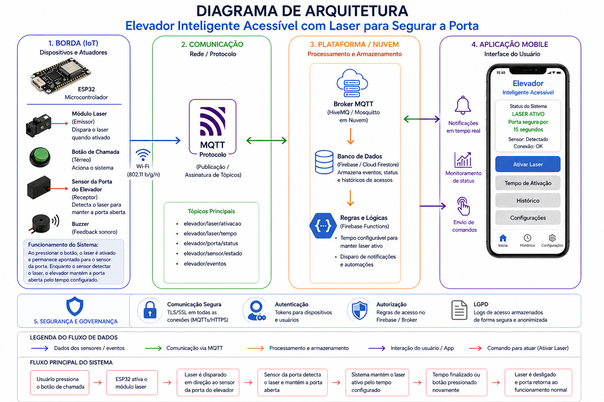
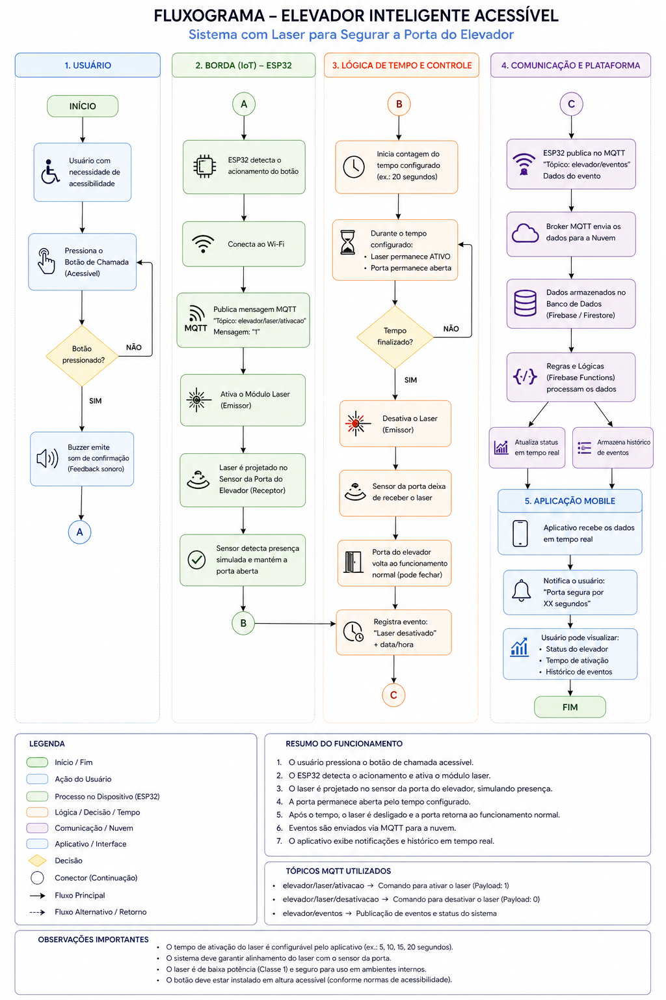
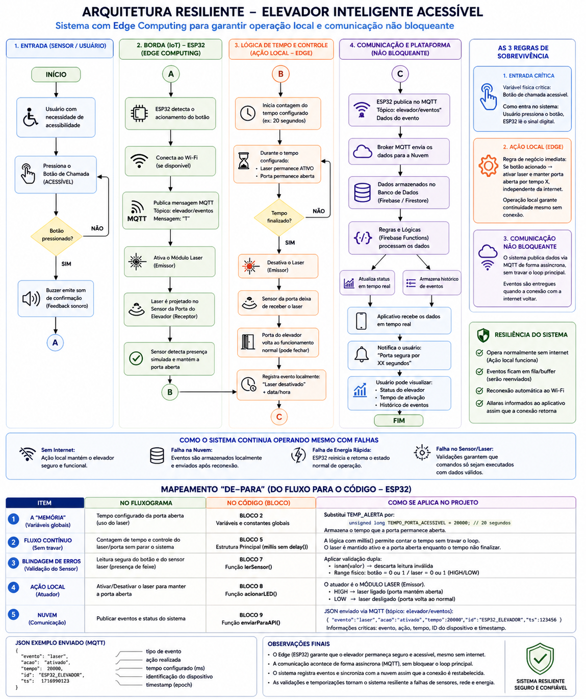
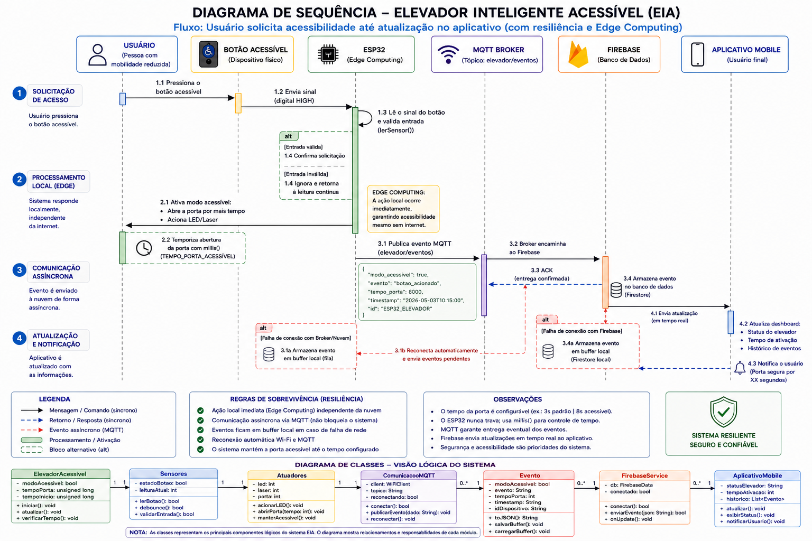

# 🚀 Elevador Inteligente Acessível (EIA)

## 📌 Descrição

O projeto **Elevador Inteligente Acessível (EIA)** tem como objetivo melhorar a acessibilidade em elevadores no ambiente do Senac, promovendo maior autonomia para pessoas com deficiência (PCDs) por meio de uma solução baseada em **IoT integrada com aplicação mobile e backend em nuvem**.

---

## 🎯 Problema

Os elevadores convencionais não possuem mecanismos adaptativos inteligentes, resultando em:

- Dependência de terceiros para uso do elevador  
- Tempo insuficiente de abertura de portas  
- Risco de incidentes durante a entrada  
- Baixa autonomia para usuários com mobilidade reduzida  

---

## 💡 Solução

O sistema proposto implementa um **modo acessível inteligente**, ativado por hardware, capaz de adaptar o comportamento do elevador.

Principais funcionalidades:

- Ativação do modo acessível via botão físico ou sensor  
- Ajuste automático do tempo de abertura da porta  
- Comunicação em tempo real entre dispositivos  
- Registro de eventos no backend  
- Visualização de status via aplicação mobile  

---

### 📌 Diagrama de Caso de Uso

---

## 🏗️ Arquitetura do Sistema

O sistema segue uma arquitetura distribuída baseada em IoT:
Botão / Sensor → ESP32 → Wi-Fi → MQTT → Backend (Firebase) → Aplicação Mobile

### 📷 Diagrama de Arquitetura

---

## ⚙️ Tecnologias Utilizadas

- ESP32 (microcontrolador)
- MQTT (comunicação IoT)
- Wi-Fi
- Firebase (backend e armazenamento)
- Flutter / Figma (interface mobile)
- Git/GitHub (controle de versão)

---

## 🔄 Funcionamento

1. Usuário ativa o sistema por botão ou sensor  
2. O ESP32 detecta o evento  
3. O modo acessível é ativado automaticamente  
4. O tempo de abertura da porta é ajustado  
5. O evento é enviado via MQTT para o backend  
6. Os dados são armazenados no Firebase  
7. O status pode ser visualizado no aplicativo mobile  

---

### 🔁 Fluxograma do Sistema

---

### 🛡️ Arquitetura Resiliente / Edge Computing

---

### 🔄 Diagrama de Sequência

---

## 📋 Requisitos

### ✔️ Funcionais

- Ativação do modo acessível  
- Ajuste automático do tempo da porta  
- Comunicação entre ESP32 e backend via MQTT  
- Registro de eventos no Firebase  
- Exibição do estado do elevador no sistema  
- Processamento de sensores físicos  
- Retorno automático ao estado padrão  

### ✔️ Não Funcionais

- Tempo de resposta inferior a 2 segundos  
- Comunicação MQTT confiável (QoS 1)  
- Sistema com alta estabilidade de conexão  
- Baixo consumo de recursos no ESP32  
- Interface simples e intuitiva  
- Não armazenamento de dados pessoais sensíveis (LGPD)  

---

## 🔐 Segurança e LGPD

O sistema segue o princípio de **Security by Design**, com foco em segurança desde a concepção.

- Validação de comandos no backend  
- Controle de acesso a dispositivos autorizados  
- Comunicação segura entre IoT e backend  
- Registro de logs para auditoria  
- Coleta mínima de dados operacionais  
- Conformidade com a LGPD (sem dados pessoais identificáveis)  

---

## 🧪 Protótipo

### 📡 IoT
- ESP32 conectado via Wi-Fi  
- Botão físico ou sensor de entrada  
- LED simulando comportamento da porta  
- Comunicação via MQTT

### 📱 Mobile
- Interface de monitoramento  
- Visualização de status do elevador  
- Histórico de eventos  

---

## 📊 Backlog

O projeto é organizado em tarefas no formato Kanban (GitHub Projects), dividido em:

- Funcionalidades essenciais (MVP)  
- Funcionalidades de suporte  
- Melhorias futuras  

---

## 🚀 Como Executar

### 📡 IoT (ESP32)

1. Conectar o ESP32 ao computador  
2. Abrir o projeto na IDE Arduino  
3. Configurar credenciais de Wi-Fi  
4. Fazer upload do código  
5. Monitorar via Serial Monitor  

---

## 📁 Estrutura do Projeto

/iot → Código do ESP32
/mobile → Aplicação mobile
/docs → Documentação técnica
/assets → Imagens e diagramas

---

## 📌 Observação Final

Este projeto integra conceitos de **IoT, redes e desenvolvimento mobile**, demonstrando uma solução funcional para acessibilidade inteligente em ambientes institucionais.
