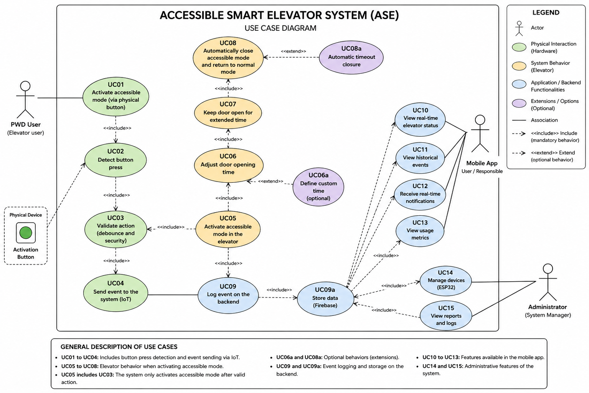
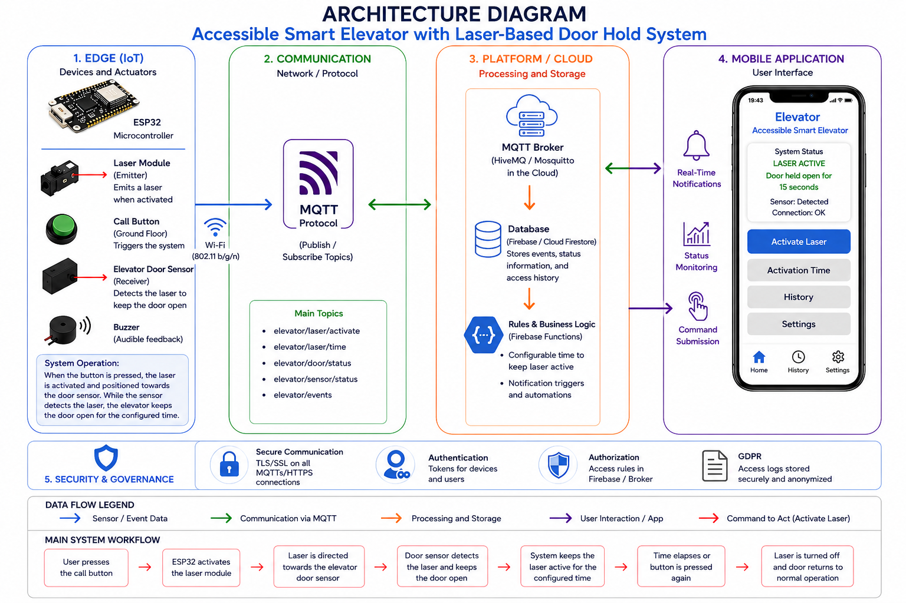
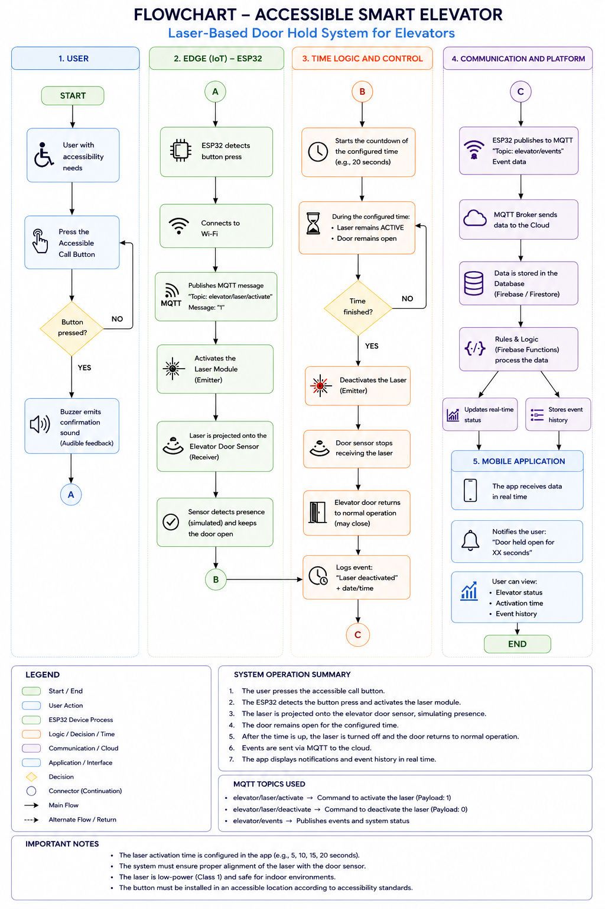
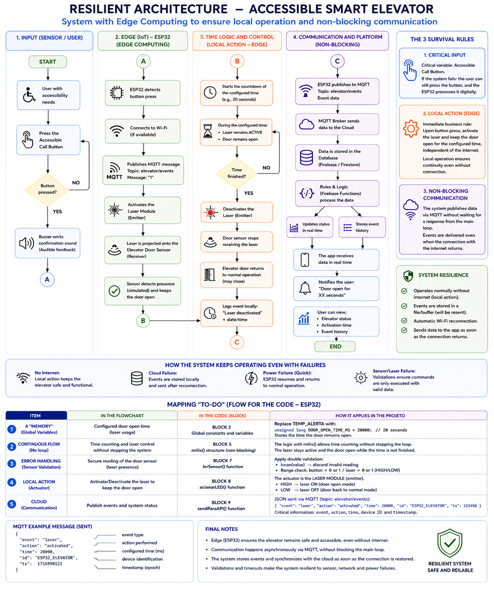
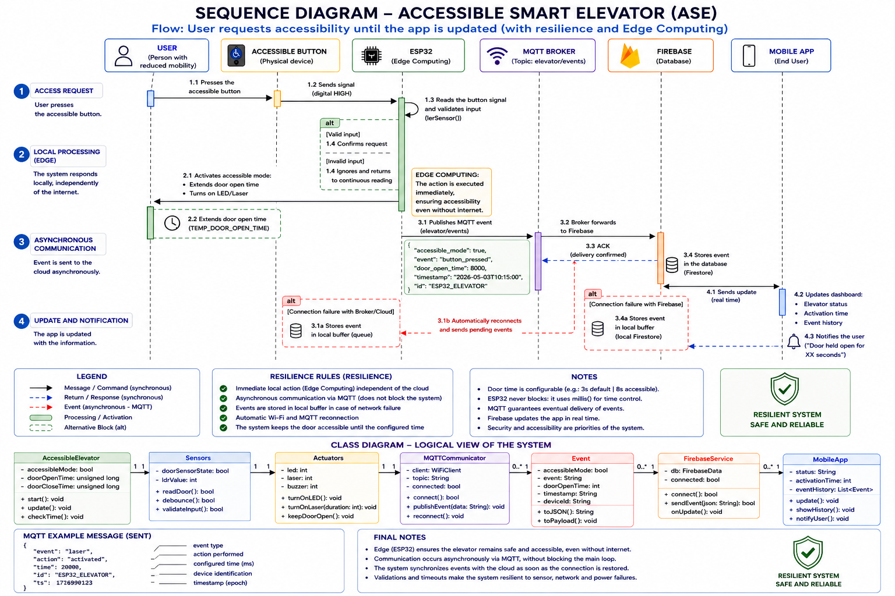
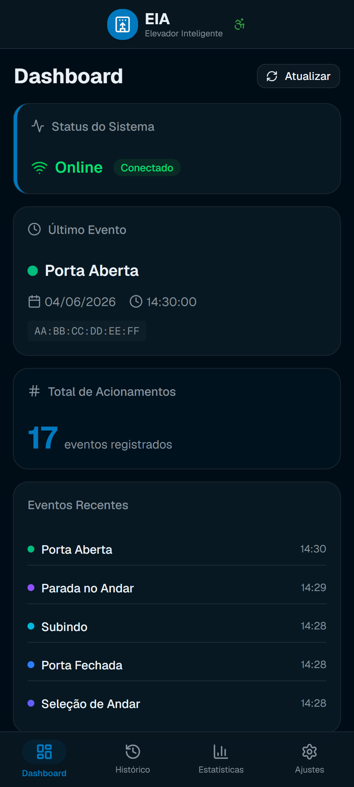

# 🚀 Accessible Smart Elevator (ASE)

🇺🇸 English | 🇧🇷 [Portuguese Version](README.md)

---

# 📌 Description

The **Accessible Smart Elevator (ASE)** project was developed to promote greater accessibility and autonomy for people with reduced mobility through the application of **Internet of Things (IoT)** technologies.

The solution consists of an **ESP32-based embedded device** responsible for registering accessibility requests through a physical button, processing information locally, and sending events to a **REST API**, which validates the device and stores the information in a **MySQL database**.

In addition to event registration, the system provides a **web dashboard** for monitoring and consulting collected data.

---

# 🎯 Problem Statement

Conventional elevators often lack intelligent accessibility mechanisms, making them difficult to use for people with disabilities or reduced mobility.

The main issues identified were:

* Dependence on third parties to use the elevator;
* Insufficient time for entering and exiting;
* Lack of accessibility event monitoring;
* Absence of usage indicators and metrics;
* Reduced user autonomy;
* Lack of integration between physical devices and management systems.

---

# 💡 Proposed Solution

The project implements an IoT-based solution capable of registering accessibility requests and making this information available for real-time monitoring.

## Implemented Features

* Physical button activation;
* Accessibility event registration;
* Automatic date and time synchronization using NTP;
* HTTP communication with a REST API;
* Device identification through MAC Address;
* Data persistence in MySQL;
* Visual feedback using an LED;
* Operational messages displayed on an I2C LCD screen;
* Automatic Wi-Fi reconnection;
* Event visualization through a web dashboard.

---

# 📌 Use Case Diagram



---

# 🏗️ System Architecture

The solution uses a distributed architecture based on Internet of Things concepts.

```text
User
  ↓
Accessibility Button
  ↓
ESP32
  ↓
Wi-Fi
  ↓
REST API (Spring Boot)
  ↓
MAC Address Validation
  ↓
MySQL Database
  ↓
Web Dashboard
```

## 📷 Architecture Diagram



---

# 🎓 Academic Course Integration

The project integrates knowledge acquired throughout the academic program and demonstrates the practical application of different disciplines.

## 🌐 Internet of Things (IoT)

* ESP32 programming;
* Hardware and software integration;
* Network communication;
* Embedded firmware development;
* Physical event processing.

## ☁️ Cloud Computing

* Integration between devices and services;
* Distributed system communication;
* Data availability for monitoring;
* API consumption.

## 🔐 Systems Security

* Unique device identification through MAC Address;
* Authorized device control;
* Event traceability;
* Security by Design principles;
* Compliance with data privacy regulations.

## 📊 Systems Analysis and Design

* Requirements gathering;
* UML modeling;
* System diagrams;
* Architecture definition;
* Technical documentation.

## ✅ Software Quality

* Failure handling;
* HTTP response validation;
* Functional testing;
* System reliability;
* Risk mitigation strategies.

## 👥 Consumer Behavior

* Accessibility needs identification;
* Problem analysis;
* Target audience definition;
* Solution justification.

## 📱 Mobile Extension Unit

* Web dashboard development;
* Event visualization interface;
* Event consultation;
* Operational monitoring.

---

# ⚙️ Technologies Used

## Hardware

* ESP32
* Physical Push Button
* Status LED
* 16x2 I2C LCD Display

## Firmware

* C++
* Arduino IDE
* ArduinoJson
* WiFi Library
* HTTPClient
* NTP (Network Time Protocol)

## Backend

* Java 21
* Spring Boot
* Spring Data JPA
* Spring Validation
* REST API

## Database

* MySQL

## Front-End

* V0
* Vercel
* Web Dashboard

## Tools

* Git
* GitHub
* Figma
* Draw.io

---

# 🔄 System Workflow

1. The user presses the accessibility button;
2. The ESP32 detects the button press;
3. The device checks Wi-Fi connectivity;
4. Time is synchronized using NTP;
5. A JSON payload containing event information is created;
6. The event is sent to the REST API through an HTTP POST request;
7. The API validates the device through its MAC Address;
8. Data is stored in the MySQL database;
9. The LCD displays the operation result;
10. The LED provides visual confirmation;
11. The dashboard makes the information available for monitoring.

---

# 🔁 System Flowchart



---

# 🛡️ Resilient Architecture / Edge Computing

The system applies Edge Computing concepts by performing part of the processing directly on the ESP32.

Implemented characteristics:

* Local event processing;
* Immediate user feedback;
* Independent operation from the dashboard layer;
* Automatic Wi-Fi reconnection;
* Communication failure handling;
* Operational continuity;
* Reduced dependency on visualization services.



---

# 🔄 Sequence Diagram



---

# 📋 Requirements

## ✔️ Functional Requirements

* FR01 – Detect physical button activation;
* FR02 – Register accessibility events;
* FR03 – Synchronize date and time through NTP;
* FR04 – Generate JSON payloads;
* FR05 – Send events to the REST API;
* FR06 – Validate authorized devices;
* FR07 – Store information in MySQL;
* FR08 – Display operational messages on the LCD;
* FR09 – Activate the LED after operation confirmation;
* FR10 – Provide event history;
* FR11 – Allow dashboard monitoring.

## ✔️ Non-Functional Requirements

* NFR01 – Operate through Wi-Fi networks;
* NFR02 – Use the HTTP protocol;
* NFR03 – Exchange data using JSON format;
* NFR04 – Support unique device identification;
* NFR05 – Handle network failures;
* NFR06 – Handle HTTP communication errors;
* NFR07 – Guarantee data persistence;
* NFR08 – Provide scalable architecture;
* NFR09 – Maintain low resource consumption;
* NFR10 – Support remote monitoring;
* NFR11 – Comply with data privacy principles.

---

# 🔐 Security and Data Privacy

The project was developed following **Security by Design** principles, incorporating security mechanisms from the beginning of development.

## Implemented Measures

* Device identification through MAC Address;
* Validation of authorized devices;
* Event logging for traceability;
* Storage of operational data only;
* No collection of personally identifiable information;
* Prepared structure for future authentication mechanisms;
* Compliance with privacy and data protection principles.

---

# 🧪 Developed MVP

## 📡 IoT Layer

* ESP32 connected to Wi-Fi;
* Physical activation button;
* I2C LCD display;
* Status LED;
* HTTP communication with REST API;
* NTP time synchronization.

## 🗄️ Backend Layer

* REST API developed with Spring Boot;
* MySQL persistence layer;
* Device validation;
* Event registration with date, time, and device identification.

## 📱 Web Dashboard

* Event monitoring;
* History consultation;
* Data visualization;
* Interface developed using V0 and deployed on Vercel.

---

# 📸 Project Evidence

## 📷 Physical Prototype

> Insert a photo of the assembled ESP32 prototype with button, LED, and LCD display.


## 💻 Serial Monitor

> Insert a screenshot of the firmware execution.


## 📱 Web Dashboard

> Insert screenshots of the developed dashboard.



## 🗄️ Database

> Insert a screenshot of the records stored in MySQL.


---

# 📈 Results Achieved

The tests performed successfully validated:

* ESP32 Wi-Fi connectivity;
* NTP time synchronization;
* HTTP communication with the REST API;
* Authorized device validation;
* MySQL data persistence;
* LCD display operation;
* LED status indication;
* Dashboard updates;
* Integration between all system layers.

The results demonstrated the technical feasibility of the solution and the successful integration of hardware, software, database, and monitoring interfaces.

---

# 📊 Backlog

The project is organized using GitHub Projects and the Kanban methodology.

## MVP Items

* Event registration;
* API communication;
* Data persistence;
* Monitoring dashboard.

## Future Enhancements

* Presence sensors;
* Native mobile application;
* Advanced analytics dashboard;
* Real-time notifications;
* Multi-elevator monitoring;
* Advanced accessibility indicators.

---

# 🚀 How to Run

## ESP32

1. Connect the ESP32 to a computer;
2. Open the project in Arduino IDE;
3. Install the required libraries;
4. Configure Wi-Fi credentials;
5. Configure the API URL;
6. Upload the firmware;
7. Monitor execution using the Serial Monitor.

## Backend

1. Configure the MySQL database;
2. Set application credentials;
3. Run the Spring Boot API;
4. Validate the event reception endpoint.

## Dashboard

1. Run the frontend project;
2. Configure API integration;
3. Deploy to Vercel.

---

# 📁 Project Structure

```text
/iot
 └── ESP32 Firmware

/api
 └── Spring Boot REST API

/database
 └── MySQL Scripts

/mobile
 └── Web Dashboard

/docs
 └── Reports and Documentation

/assets
 └── Diagrams and Images
```

---

# 🔮 Future Improvements

* Presence sensor integration;
* Complete mobile application;
* Advanced analytics dashboard;
* Real-time notifications;
* Multi-elevator monitoring;
* Accessibility and usage indicators;
* Integration with institutional systems;
* Automated usage reports.

---

# 📌 Conclusion

The **Accessible Smart Elevator (ASE)** project demonstrates the practical application of concepts related to Internet of Things, Cloud Computing, Systems Security, Software Quality, Mobile Development, and Systems Analysis.

The solution integrates hardware, software, database, and web interfaces to create a platform capable of registering accessibility events, storing information in a structured manner, and providing real-time monitoring.

The achieved results confirm the feasibility of the proposal and highlight the potential of technology to support accessibility, inclusion, and digital transformation initiatives in institutional environments.
